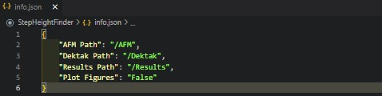
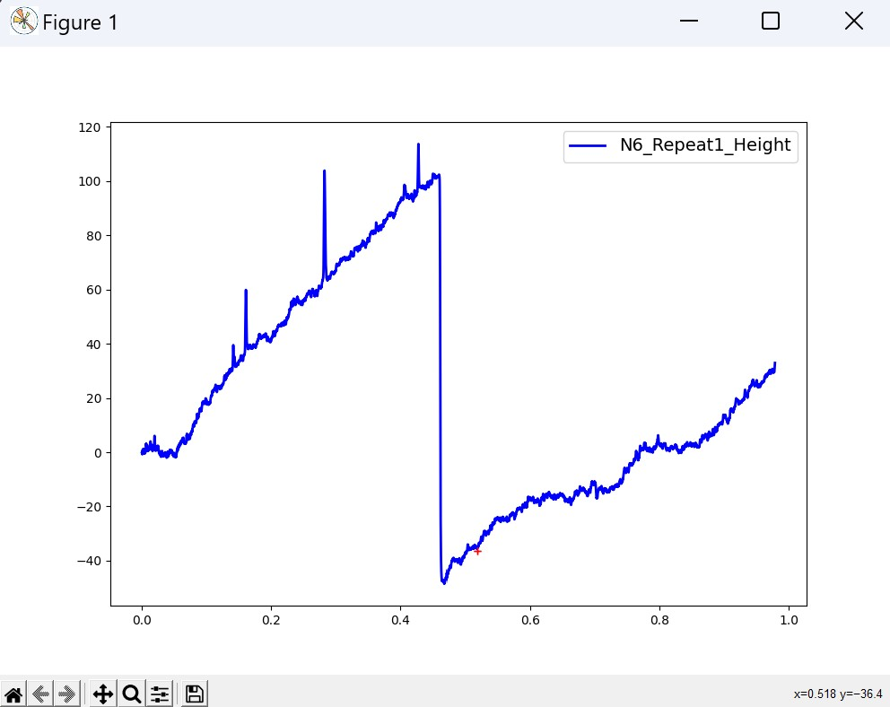
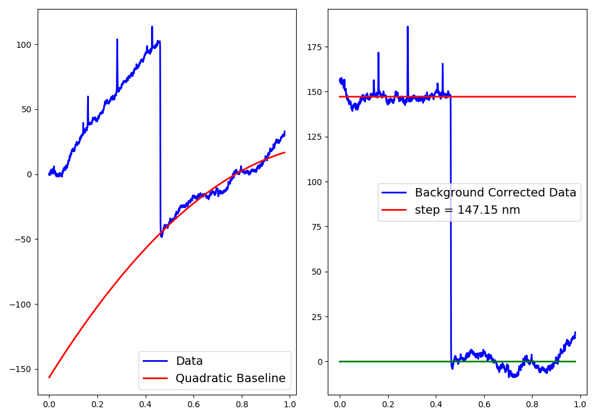
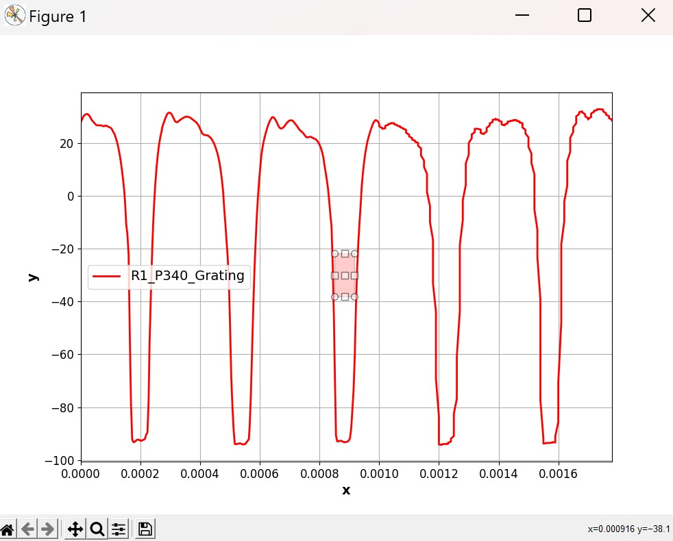
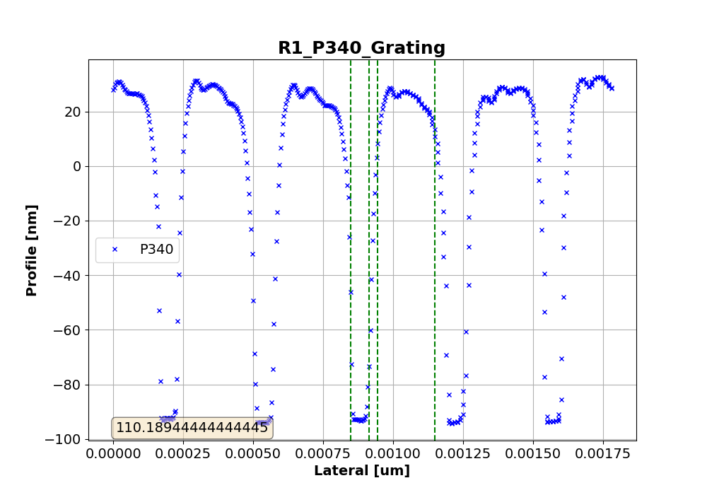

# Surface Profile Analysis

This software is designed for analysis of thin film structures using either atomic force microscopy or surface profilomtery techniques. To date the software is designed for use with Bruker AFM and Bruker Dektak systems.

This software was created by Josh Male in November 2022 as part of the ongoing analyis of thin film structures. The code is under an MIT License and can be freely used.

## Updates that need changing in readme.md

Changed the way the directory path function works, no longer uses interactive selector for windows devices, or relative paths for mac/linux devices, now only uses absolute file paths for simplicity. All controlled through info.json.
Need to check that all the functions are correctly commented in their descriptions. It would appear many have been copied over from other areas and have the incorrect descriptions below them. Also need to make sure the function descriptions follow the convention.

## Contents

* [General Information](#general-information)
* [Package Requirements](#package-requirements)
* [Launch](#launch)
* [Setup](#setup)
  * [Directory Paths](#directory-paths)
  * [File Names](#file-names)
  * [File Types](#file-types)
* [Dektak Thickness Analysis](#dektak-thickness-analysis)
  * [Region of Interest](#dektak-region-of-interest)
  * [Dektak Levelling](#dektak-levelling)
  * [Batch Processing](#dektak-batch-processing)
* [AFK Thickness Analysis](#afm-thickness-analysis)
  * [Region of Interest](#afm-region-of-interest)
  * [AFM Processing](#afm-processing)
  * [Batch Processing](#afm-batch-processing)
* [Code Functions](#code-functions)
* [Acknowledgements](#acknowledgements)

## General Information

Step height calculator built using Python 3 to find step height and feature width or surfaces and structures in thin films measured with Bruker AFM and Dektak systems. Suitable for all structures that can be measured with either of these systems.

## Package Requirements

Language and package requirements can also be found in requirements.txt. The code was built using the following languages and module versions.

* Python 3.6-3.10
* tk 0.1.0 -- don't need this anymore
* numpy 1.21.4
* matplotlib 3.5.0
* scipy 1.7.2

## Launch

The code can be run from any terminal or editor. Main scripts are in the repository's main directory, while source code is stored safely in /src. The code relies on the use of info.json file for non-windows operating systems, this should be kept in the main repository directory.

## Setup

### Directory Paths

The code relies heavily on the info.json file for non-windows operating systems for data and results directory paths, this is to relieve pressure from any users from altering the script, and to ensure user alterations don't break the code. The info.json file should contain the following file paths:

* {
    "AFM Path": "/relative/path/to/AFM/measurements",
    "Dektak Path": "/relative/path/to/dektak/measurements",
    "Results Path": "/relative/path/to/results/directory"
}

Where the relative paths are relative to the root directory (main directory of the repository). Windows devices make use of tkinter's interactive path selector and are able to select target files directly. The results path still needs to be present on all devices. Default paths are set to:

* {
    "AFM Path": "/AFM",
    "Dektak Path": "/Dektak",
    "Results Path": "/Results"
}

The code is able to distinguish between Bruker Dektak and Bruker AFM measurements using the parent directory name "AFM" and "Dektak", so data from either machine must be stored in a directory called Dektak or AFM for processing.

### File Names

Handling data and information is always a challenging aspect of coding. It's far easier to convey specific file information within the file name itself than to have a bank of dictionaries, text files, or other storage format files somewhere with all the relevant information required for data processing. This software is no different, and as such, there are specific pieces of information that are required from the file name that need to be detailed in the info.json file. The parameters that are required in the file name are:

* Primary sample identifier string:
  * This may be a string like "A1", "Sample1", or "CharacterisationSample17". Either way, there must be some form of sample identifier within the file name.
  * This string must be one word.
* Secondary sample identifier string:
  * This is required for batch storage purposes and is used to group measurements from the same sample into one results dictionary and allows the dictionary keys to remain separate as to not overwrite data.
  * This string may be somelike like "P250" for a grating of period 250nm, "Ridge1", "SecondWaveguide", etc., and it must be one word.
* The primary and secondary sample identifier strings must be separated from each other, and the remaining information contained within the file name using the "_" character (underscore character).
  * An example file name would be - "A1_Ridge1_any_other_relative_information.csv".
  * It is important to know that the primary and secondary indentifier strings must be first and second in the file name string.
  * Any information in the first two "_" separated segments will be called into the code regardless of their nature.

This is all that is required for files to be processed in this code. Any other information stored within the file names is carried through and ignored during processing. The strings will remain in any results dictionary. To, again, keep the process as simple as possible for the user, the primary and secondary identifier strings must be first and second in the file name.

### File Types

The default output of the Bruker AFM and Bruker Dektak systems is a comma delimited .csv file. The code is optimised for use with csv files, though Bruker AFM files may also be .txt files and the code will still run regardless. All output files are .json dictionaries, which is one of the standard file types for outputting data in python software. The software does not, by default, output any graphs, but this can be changed by altering the "Plot Graphs" key in the info dictionary to True. Doing this will ensure that all figures are plotted from step height and feature width measurements and saved to the results directory. Note that all figures are saved as png files.

### Default Info

As discussed in this section, all the user interface is done through the info.json file included in the main directory of the repository. This file can be opened using any text editor, and can be adjusted by the user with little-to-no consequence. The default info.json looks like this:

## Dektak Thickness Analysis

The Bruker Dektak is a surface profilometer capable of measuring surface profile and surface-feature deminsions. In this code we use the Dektak to measure step height, the Dektak is not capable of resolving any surface feature smaller than the measuring tip used, which is typically around 1-2 micrometers. Due to the nature of the Dektak's measuring technique, there can be an associated tilt in any acquired data, and as such the Dektak code in this software includes a levelling quadratic equation tool.

### Dektak Region of Interest

We begin by selecting two regions of interest around a step in the surface profile. This must be done from left to right in a region of interest, but does not matter whether the pre-step or post-step region is selected first. I.e., in a region of interest before the step, select from left to right, then repeat for post-step, with neither pre- or post-step order important. The region of interest selector for data levelling utilises matplotlib's ginput tool, so the user need only select a region on the x-axis with a click (point) and the y-axis value is irrelevant. This can be seen here with the first region of interest marked with a red x:

### Dektak Levelling

The code uses the difference in profile values across a region of ineterest to estimate a quadratic function to fit the tilt. From there the data is levelled and the difference between the two regions is calculated. The step height is calculated from the average of the y-values between the two regions post-levelling, and the error is calculated using a standard error on the mean of the two regions. Once levelled and calculated, the final result looks like:

### Dektak Batch Processing

The batch processing files, indicated with a batch_ before the script name are designed to collect like-measurements and average the film thickness across the repeat measurements. Again this is done by taking a mean value of the repeat film thicknesses and then taking a standard error on the mean. Result files then contain the individual film parameters and the average result.

## AFM Thickness Analysis

The Bruker AFM is a surface profilometer capable of measuring surface profile, surface roughness, and small surface-feature dimensions. In this code, we use the AFM to measure the etch depth of thin film gratings. There is minimal tilt associated with the AFM, and therefore the region of interest tool used can be far more interactive and natural than with the Dektak system. Also to keep it obvious which type of measurement the user is performing, the region of interest tool is a rectangle selector rather than a point tool.

### AFM Region of Interest

We begin by selecting two regions of interest separately, with each region requiring the user to close the window between selections. This does allow the user to adjust the desired region, and use python's zoom functions to ensure the region selected is the intended region. The softare takes the last entry as the desired region of interest. In this instance, it does not matter which order the steps are taken in, or in which direction the rectangle is pulled. An example of the rectangle selection tool can be seen here:

### AFM Processing

As with the dektak system, the software averages the two selected regions' y-values and takes a standard error on the mean for both regions. Using simple subtraction and error calculation, the software produces a step height between the two profile values for each region and produces an error. All information is saved into the appropriate json files.

### AFM Batch Processing

The batch processing files, indicated with a batch_ before the script name are designed to collect like-measurements and collect individual secondary string files into one results file for further analysis or reporting. E.g., if the user is measuring multiple gratings on a single sample, then they may wish to have the individual grating thicknesses stored within the sample file.

## Code Functions

All code functions are well commented and described in the individual function definitions. In my opinion, there is little need to go in to great depth here. This section may update with frequently asked questions from users in the future to further explain the code.

While it is not advised that users edit the src code, feel free to read and understand the levelling and analysis processes further.

## Acknowledgements

Thanks go to Manuel and Sam for optimising the data levelling quadratic function.